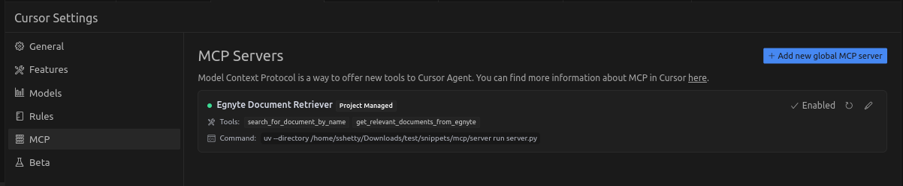
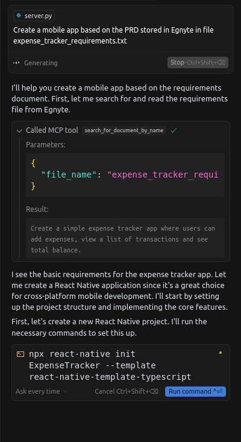

# Egnyte MCP Server

An **MCP (Model Context Protocol)** server that connects to your Egnyte domain and exposes document search and retrieval functionality for use in **AI agents** like Cursor, Claude, or OpenAI.

This server uses **Egnyte’s public APIs and Python SDK** to support secure, real-time access to your Egnyte content—enabling smart AI-driven workflows while respecting existing permissions.

---

## 📚 About

Model Context Protocol (MCP) is a framework to help AI agents securely query external systems for real-time context.  
The **Egnyte MCP Server** allows agents to:

- Search for documents by name
- Retrieve relevant documents from Egnyte
- Seamlessly integrate enterprise content into generative AI workflows

---

## 🛠️ Tools Implemented

| Tool Name                          | Description                                                                 |
|-----------------------------------|-----------------------------------------------------------------------------|
| `search_for_document_by_name`     | Searches for a document in your Egnyte domain using its filename.           |

---

## 📋 Requirements

- Python 3.11+
- Egnyte API access token - Register on https://developers.egnyte.com/member/register to get API key for your Egnyte account 
- An Egnyte domain with files to test


# Installing Prerequisites 

## 🔧 Installation

### 1. Clone the Repository

```bash
git clone https://github.com/egnyte/mcp-server-egnyte.git
cd mcp/server/
```

### 2. Install `uv` (Python environment & dependency manager)

**Mac/Linux:**

```bash
curl -LsSf https://astral.sh/uv/install.sh | sh
```

**Windows (PowerShell):**

```powershell
irm https://astral.sh/uv/install.ps1 | iex
```

### 3. Install Egnyte SDK

```bash
uv pip install egnyte
```

📄 [Egnyte SDK Documentation](https://developers.egnyte.com/egnyte_sdk#python)  
🔗 [Egnyte SDK GitHub](https://github.com/egnyte/python-egnyte)

### 4. Setting up Environment Variables
1. **Create a `.env` File**

  Create a `.env` file inside the root directory with the following content:
  ```
  DOMAIN=your-egnyte-domain.egnyte.com 
  ACCESS_TOKEN=your-access-token-here
  ```
2. **Update with Your Credentials**

- Replace `your-egnyte-domain.egnyte.com` with your actual Egnyte domain.
- Replace `your-access-token-here` with your actual Egnyte API access token.

  This `.env` file is necessary for the server to authenticate and connect securely to your Egnyte domain.


# 🚀 Running the MCP Server

```bash
uv run server.py --python 3.11
```

This will start the MCP server locally and make the tools available to MCP-compliant clients.


## Installing MCP Server

```
cd mcp/server/
curl -LsSf https://astral.sh/uv/install.sh | sh # Install uv
uv pip install egnyte
uv run server.py --python 3.11
```

# ⚡ Setting up MCP Clients

This is a sample MCP (Model Context Protocol) client that connects to a locally running MCP server using `fastmcp`.  
It uses **Python Stdio Transport** to communicate with the server and call specific tools by name.

## How it works

- Connects to the MCP server (`server.py`) via Python Stdio.
- Lists available tools exposed by the server.
- Calls a specific tool by its name, with provided arguments.
- The response is returned based on the tool execution.

## Prerequisites

- Python 3.11+
- `fastmcp` library installed:
  ```bash
  uv pip install fastmcp
- MCP server (`server.py`) running locally
- `.env` file configured

## Usage

1. **Ensure the MCP server is running** first.
2. **Run the client** using the command:
   ```bash
   python client.py

###  Cursor IDE Setup

1. Open Cursor → Settings → **MCP**
2. Click **"Add new global MCP server"**
3. Add the following configuration:

```json
{
  "mcpServers": {
    "Egnyte Document Retriever": {
      "command": "uv",
      "args": [
        "--directory",
        "/path/to/mcp/server",
        "run",
        "server.py"
      ]
    }
  }
}
```
✅ Replace `/path/to/mcp/server` with your actual directory path.

4. Save and enable the server in the MCP settings.

---

## 🖼️ Example Screenshots

### Cursor MCP Server Configuration



### Cursor MCP Query in Action



---

## 📈 Roadmap

- ✅ File search by name
- ✅ Retrieve relevant documents
- 🔜 Hybrid search (structured + content)
- 🔜 Document text extraction

---

#Helping with development

Please report any problems you find to api-support@egnyte.com or pint@egnyte.com

If you'd like to fix something yourself, please fork this repository, commit the fixes and updates to tests, then set up a pull request with information what you're fixing.

## 🔗 Helpful Links

- [Egnyte Developer Portal](https://developers.egnyte.com/)
- [Egnyte Python SDK](https://github.com/egnyte/python-egnyte)
- [Cursor MCP Documentation](https://docs.cursor.com/context/model-context-protocol)
